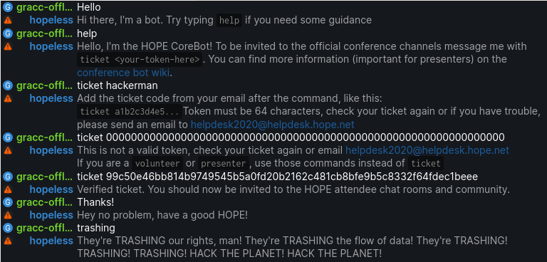

# Hope 2020 matrix bot
Based on the extremely useful nio-template  
Users message the bot with their ticket token which is validated and they get invited to the conference matrix rooms.  

## Features
Sending a DM to the bot or prefixing with the command string (default !c) followed by the below commands will trigger the behaviour
* ticket \<token\>     #authenticates user and invites them to the attendee rooms
* presenter \<token\>  #authenticates user and invites them to the presenter rooms
* volunteer \<password\> #grants access to the volunteer rooms
* oncall \<password\>    #allows joining and leaving the volunteer oncall room
* Realistic AI responds to phrases such as "hello" and "thanks"
 ### Admin commands
* notice \<room\> \<string\>,,,    #sends an @room notice to specified room
* sync   #syncs the token list to disk
* invite \<user\> \<room\>   #invite user to room
* invite_group \<user\> \<group\>  #invite user to group of rooms
* schedule_announce \<timestamp\> \<room\> \<string\>,,,  #schedule an annoucement
## Running
To build with docker: run `docker build -f docker/Dockerfile -t hopeless:latest .` in the repo root dir.

git clone and copy sample.config.yaml to data/config.yaml and fill in the user and server details.
Also in data/, rooms.csv holds a newline separated list of the room ids (no commas)
tokens.csv holds hashes of 64 char tokens followed by either "unused" or the
user's name

Running with docker:
`docker run -v $(pwd)/data:/data hopeless:latest`

Running:

`python main.py`

**TODO** in order of importance:
* "welcome-bot" functionality - auto-message new users on the server
* Better utility for volunteers, maybe not a token system
* hot-reload of tickets

## Project structure

### `main.py`

Initialises the config file, the bot store, and nio's AsyncClient (which is
used to retrieve and send events to a matrix homeserver). It also registering
some callbacks on the AsyncClient to tell it to call some functions when
certain events are received (such as an invite to a room, or a new message in a
room the bot is in).

It also starts the sync loop. Matrix clients "sync" with a homeserver, by
asking constantly asking for new events. Each time they do, the client gets a
sync token (stored in the `next_batch` field of the sync response). If the
client provides this token the next time it syncs (using the `since` parameter
on the `AsyncClient.sync` method), the homeserver will only return new event
*since* those specified by the given token.

This token is saved and provided again automatically by using the
`client.sync_forever(...)` method.

### `config.py`

This file reads a config file at a given path (hardcoded as `config.yaml` in
`main.py`), processes everything in it and makes the values available to the
rest of the bot's code so it knows what to do. Most of the options in the given
config file have default values, so things will continue to work even if an
option is left out of the config file. Obviously there are some config values
that are required though, like the homeserver URL, username, access token etc.
Otherwise the bot can't function.

### `storage.py`

Creates (if necessary) and connects to a SQLite3 database and provides commands
to put or retrieve data from it. Table definitions should be specified in
`_initial_setup`, and any necessary migrations should be put in
`_run_migrations`. There's currently no defined method for how migrations
should work though.

### `callbacks.py`

Holds callback methods which get run when the bot get a certain type of event
from the homserver during sync. The type and name of the method to be called
are specified in `main.py`. Currently there are two defined methods, one that
gets called when a message is sent in a room the bot is in, and another that
runs when the bot receives an invite to the room.

The message callback function, `message`, checks if the message was for the
bot, and whether it was a command. If both of those are true, the bot will
process that command.

The invite callback function, `invite`, processes the invite event and attempts
to join the room. This way, the bot will auto-join any room it is invited to.

### `bot_commands.py`

Where all the bot's commands are defined. New commands should be defined in
`process` with an associated private method. `echo` and `help` commands are
provided by default.

A `Command` object is created when a message comes in that's recognised as a
command from a user directed at the bot (either through the specified command
prefix (defined by the bot's config file), or through a private message
directly to the bot. The `process` command is then called for the bot to act on
that command.

### `message_responses.py`

Where responses to messages that are posted in a room (but not necessarily
directed at the bot) are specified. `callbacks.py` will listen for messages in
rooms the bot is in, and upon receiving one will create a new `Message` object
(which contains the message text, amongst other things) and calls `process()`
on it, which can send a message to the room as it sees fit.

A good example of this would be a Github bot that listens for people mentioning
issue numbers in chat (e.g. "We should fix #123"), and the bot sending messages
to the room immediately afterwards with the issue name and link.

### `chat_functions.py`

A separate file to hold helper methods related to messaging. Mostly just for
organisational purposes. Currently just holds `send_text_to_room`, a helper
method for sending formatted messages to a room.

### `errors.py`

Custom error types for the bot. Currently there's only one special type that's
defined for when a error is found while the config file is being processed.

### `sample.config.yaml`

The sample configuration file. People running your bot should be advised to
copy this file to `config.yaml`, then edit it according to their needs. Be sure
never to check the edited `config.yaml` into source control since it'll likely
contain sensitive details like passwords!
